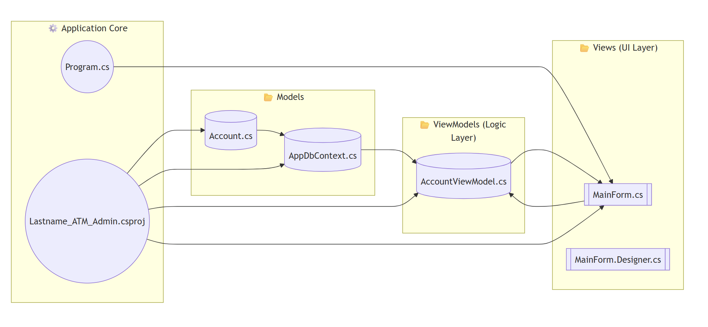

# ATM Admin GUI: Guided Hands-on on Windows Form and MySQL



## 📂 Project Directory Structure

```
Lastname_ATM_Admin/
│
├── Models/
│   └── Account.cs
│   └── AppDbContext.cs
│
├── ViewModels/
│   └── AccountViewModel.cs
│
├── Views/
│   └── MainForm.cs
│   └── MainForm.Designer.cs
│
├── Migrations/
│   └── (EF Core migration files auto-generated)
│
├── Program.cs
└── Lastname_ATM_Admin.csproj
```

---

### Outline

* **Models/** → Contains **entities (classes)** like `Account.cs` that represent your database tables. This is your **blueprint for data**.
* **Data/** → Contains `AppDbContext.cs`, which acts as the **bridge between C# and MySQL** using Entity Framework Core.
* **ViewModels/** → Holds logic classes like `AccountViewModel.cs` that connect the **UI (View)** with the **data (Model)**, following MVVM principles.
* **Views/** → Contains Windows Forms (`MainForm.cs`) where you design and code the **user interface** (buttons, textboxes, DataGridView).
* **Migrations/** → Auto-generated folder created when you use EF Core **Code-First Migrations**. Keeps track of changes to your database schema.
* **Program.cs** → The starting point of your app (`Main` method).
* **.csproj file** → The project definition (dependencies, references, etc.).

---

With this structure, clearly established the **Separation of Concerns**:

* **Data (Model)** = Database
* **UI (View)** = Windows Forms
* **Logic (ViewModel)** = Operations between them

---

