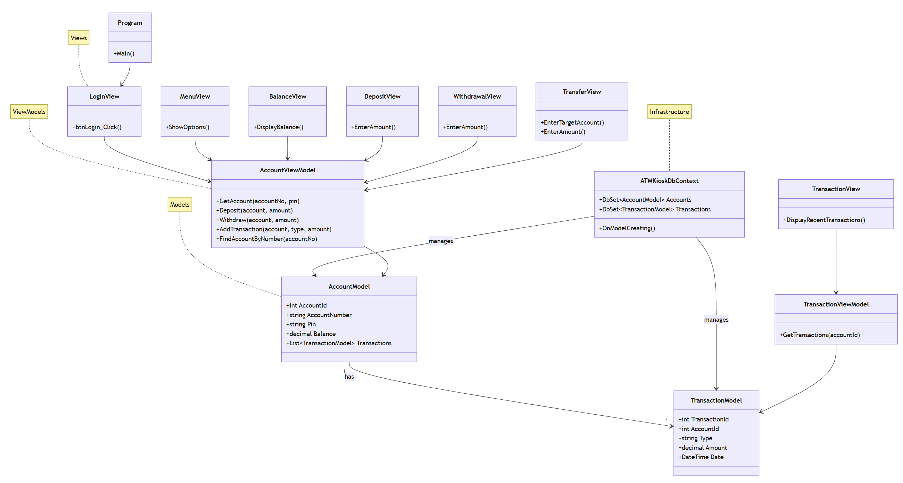

# A Simple GUI Demo for ATM Kiosk using OOP and MVVM design

### Preview


### Solution Setup


### Package Manager Console Commands

```bash
PM> Install-Package Microsoft.EntityFrameworkCore
PM> Install-Package Pomelo.EntityFrameworkCore.MySql

PM> Add-Migration InitialCreate
PM> Update-Database
```

### MySQL Setup

```sql
CREATE DATABASE ATMDB_A22X_W7;
```

### Class Diagram


### ATM Kiosk Class Diagram Explanation

| **Layer**         | **Class**              | **Purpose / Responsibility**                                                                                     |
|--------------------|------------------------|------------------------------------------------------------------------------------------------------------------|
| **Models**        | `AccountModel`         | Represents a bank account. Stores **AccountId, AccountNumber, Pin, Balance**, and its related transactions.       |
|                    | `TransactionModel`     | Represents a single transaction. Stores **TransactionId, AccountId, Type, Amount, Date**.                        |
| **ViewModels**    | `AccountViewModel`     | Handles account logic: **login, deposit, withdraw, transfer**, and adding transactions.                          |
|                    | `TransactionViewModel` | Handles transaction logic: retrieves and provides **recent transactions** for display.                           |
| **Views**         | `LoginView`            | Login form. Allows user to enter account number and PIN to access the kiosk.                                     |
|                    | `MenuView`             | Main menu form. Provides navigation to other transaction views (Balance, Withdraw, Deposit, etc.).               |
|                    | `BalanceView`          | Displays the **current balance** of the logged-in account.                                                       |
|                    | `DepositView`          | Form for entering a deposit amount. Updates balance and records transaction.                                     |
|                    | `WithdrawalView`       | Form for withdrawing an amount. Checks balance before deducting.                                                 |
|                    | `TransferView`         | Form for transferring money to another account. Validates account and updates both accounts.                     |
|                    | `TransactionView`      | Displays **recent transactions** in a table (DataGridView).                                                      |
| **Infrastructure**| `ATMKioskDbContext`    | Entity Framework Core DbContext. Manages **Accounts** and **Transactions** tables in MySQL.                      |
|                    | `Program`              | Entry point of the application. Starts the kiosk by opening the **LoginView** form.                              |


# Week 7 Formative Assessment

### ATM Kiosk Test Cases (10 pts each)

| **Test Case ID** | **Feature**            | **Steps**                                                                                                                                 | **Expected Result**                                                                                   | **Points** |
|------------------|------------------------|-------------------------------------------------------------------------------------------------------------------------------------------|-------------------------------------------------------------------------------------------------------|------------|
| TC01             | View Balance           | 1. Login with valid Account Number and PIN.<br>2. Select **Balance Inquiry** from menu.                                                   | The system displays the current balance of the logged-in account.                                     | 10         |
| TC02             | Cash Withdrawal        | 1. Login.<br>2. Select **Cash Withdrawal**.<br>3. Enter amount within available balance.<br>4. Confirm transaction.                        | The system deducts the amount from balance and shows the updated balance.                             | 10         |
| TC03             | Cash Deposit           | 1. Login.<br>2. Select **Deposit**.<br>3. Enter a valid amount (e.g., 500).<br>4. Confirm.                                                 | The system adds the amount to balance and shows the updated balance.                                  | 10         |
| TC04             | Cash Transfer          | 1. Login.<br>2. Select **Transfer**.<br>3. Enter valid **target account number** and transfer amount.<br>4. Confirm.                       | The sender’s balance decreases, target account’s balance increases, and transactions are recorded.    | 10         |
| TC05             | View Transactions      | 1. Login.<br>2. Select **Recent Transactions** from menu.                                                                                 | The system shows a list of recent transactions (Deposit, Withdrawal, Transfer) in a table view.       | 10         |
| TC06             | Exit                   | 1. Login.<br>2. Select **Exit** from menu.<br>3. Confirm exit.                                                                             | The application closes completely.                                                                    | 10         |

---

📌 **Instruction to Students**:  
- Perform each test case.  
- Record your screen while running the test case.  
- Submit the video recording as evidence for grading.

