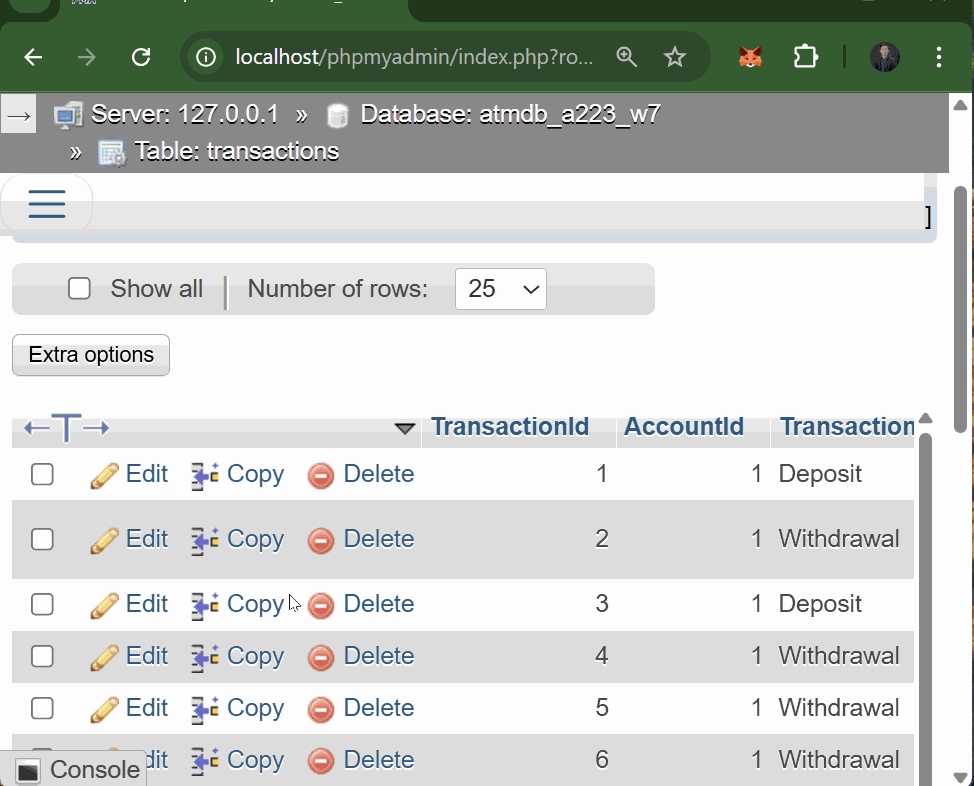
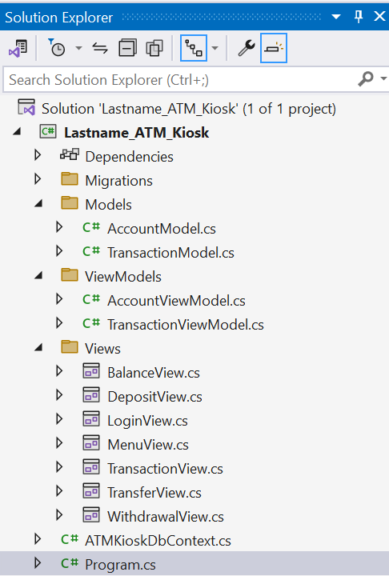

# A Simple GUI Demo for ATM Kiosk using OOP and MVVM design

### Preview



### Solution Setup


### Package Manager Console Commands

```bash
PM> Install-Package Microsoft.EntityFrameworkCore
PM> Install-Package Pomelo.EntityFrameworkCore.MySql

PM> Add-Migration InitialCreate
PM> Update-Database
```

### MySQL Setup

```sql
CREATE DATABASE ATMDB_A22X_W7;
```
